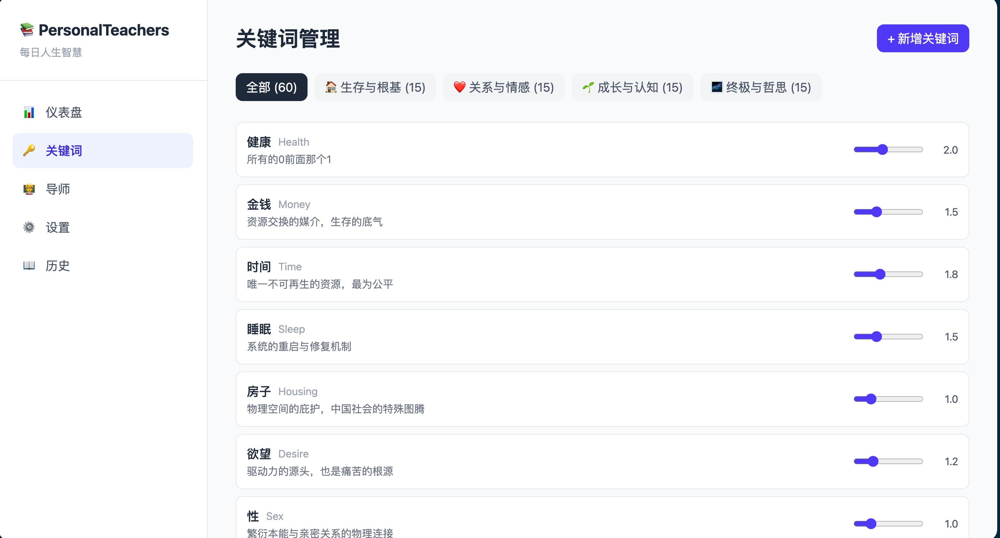
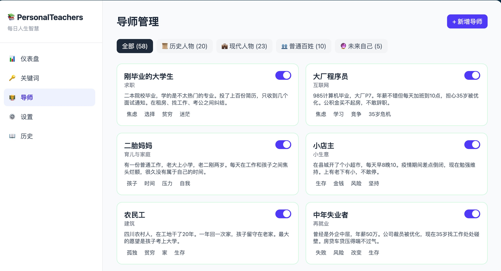
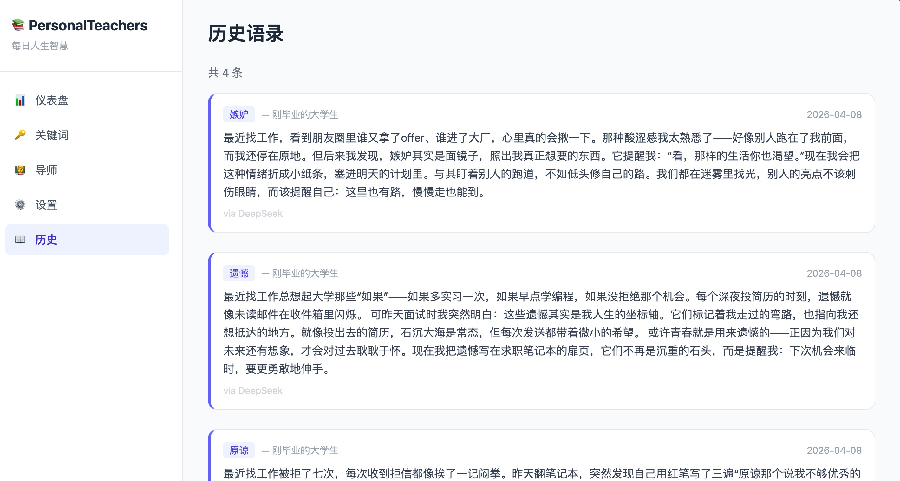
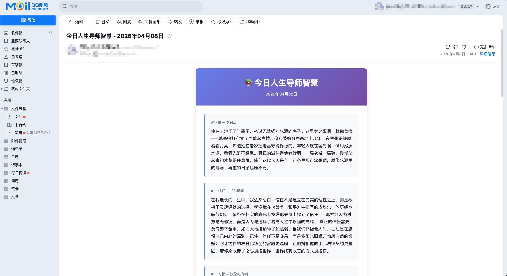
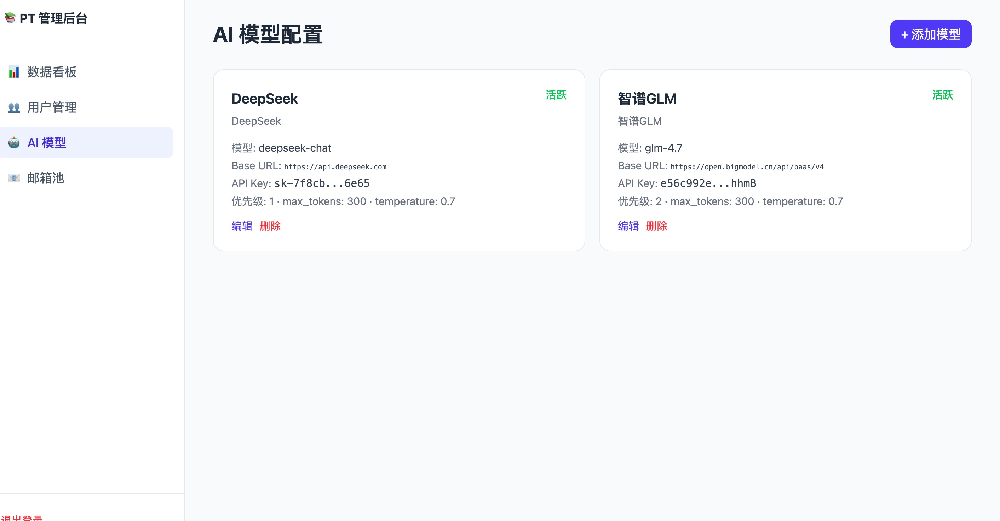

# PersonalTeachers - 人生导师每日推送系统

<div align="center">

**通过多元化虚拟导师的每日智慧推送，建立360度认知体系**

[](https://www.python.org/)
[](https://fastapi.tiangolo.com/)
[](https://vuejs.org/)
[](LICENSE)

**[在线体验](http://erode.site)** | [功能特性](#-功能特性) | [快速开始](#-快速开始) | [系统架构](#-系统架构)

</div>

---

## 版本说明

| 版本 | 说明 |
|------|------|
| **v1** | 单用户版，无注册登录，配置驱动（YAML），`main` 分支的早期提交 |
| **v2**（当前） | **多用户版**，支持注册登录，每个用户独立设置个性化偏好，独立管理后台 |

v2 是对 v1 的完整重写，从单用户架构升级为多用户 SaaS 架构，包含用户认证、个性化配置、管理后台等企业级特性。

---

## 功能展示

### 用户体验

<table>
<tr>
<td align="center"><b>关键词管理</b></td>
<td align="center"><b>导师管理</b></td>
</tr>
<tr>
<td></td>
<td></td>
</tr>
<tr>
<td align="center"><b>语录历史</b></td>
<td align="center"><b>推送效果</b></td>
</tr>
<tr>
<td></td>
<td></td>
</tr>
</table>

### 管理后台

<div align="center">

<p><b>AI 模型管理</b> — 可视化配置多模型、优先级、自动降级</p>
</div>

---

## 功能特性

### 用户系统
- 注册登录（邮箱验证码 + JWT 认证）
- 每个用户独立的偏好设置
- 自定义推送时间
- 个性化关键词权重
- 自定义导师启用/禁用

### 智能生成
- 根据用户偏好动态生成语录
- 加权随机 + 四象限多样性保证的关键词选择算法
- 多 AI 模型支持，自动降级容错
- 语录质量校验 + 不足时自动补生成

### 多元导师池

| 类别 | 数量 | 代表人物 |
|------|------|----------|
| 历史人物 | 15位 | 老子、孔子、苏格拉底、巴菲特 |
| 现代人物 | 20位 | 马斯克、纳瓦尔、颜宁、吴军 |
| 普通百姓 | 10位 | 打工者、二胎妈妈、退休工人 |
| 未来自己 | 5个模板 | 3年/5年/10年/20年/临终前的你 |

### 60个关键词体系（四象限）

```
生存与根基 (15个)：健康、金钱、时间、睡眠...
关系与情感 (15个)：爱、伴侣、父母、情绪...
成长与认知 (15个)：选择、认知、执行、复利...
终极与哲思 (15个)：自由、自我、意义、死亡...
```

### 管理后台
- 用户管理（查看、启停）
- AI 模型配置（CRUD、优先级、多 Provider）
- 邮箱发送池管理（多发件人轮询、每日限额）
- 数据统计仪表盘

---

## 快速开始

### 环境要求

- Python 3.10+
- Node.js 18+（前端构建）
- 现代浏览器

### 后端

```bash
cd backend
python3 -m venv venv
source venv/bin/activate
pip install -r requirements.txt

# 配置环境变量
cp .env.example .env
# 编辑 .env 填入 SMTP 和其他配置

# 启动
python run.py
```

### 前端

```bash
# 用户端
cd frontend
npm install
npm run build   # 生产构建

# 管理后台
cd admin
npm install
npm run build   # 生产构建
```

### 部署

项目提供完整的部署配置（nginx + systemd）：

```bash
# 参考 deploy/ 目录
# nginx 反向代理配置：deploy/nginx.conf
# systemd 服务配置：deploy/personalteachers.service
```

---

## 系统架构

```
┌──────────────┐  ┌──────────────┐
│  用户前端 SPA  │  │  管理后台 SPA  │   Vue 3 + TailwindCSS
│  (port 5173)  │  │  (port 5174)  │
└──────┬───────┘  └──────┬───────┘
       │                 │
       └────────┬────────┘
                │  HTTP API
       ┌────────▼────────┐
       │   FastAPI 后端    │   JWT 认证 + APScheduler
       └────────┬────────┘
                │
    ┌───────────┼───────────┐
    │           │           │
┌───▼───┐ ┌────▼────┐ ┌───▼────┐
│用户系统│ │语录生成  │ │邮件推送 │
│认证偏好│ │导师+引擎 │ │调度+池化│
└───┬───┘ └────┬────┘ └───┬────┘
    │          │          │
    └──────────┼──────────┘
               │
    ┌──────────▼──────────┐
    │    AI 模型层          │  OpenAI 兼容接口 + 降级链
    │  DeepSeek / GLM ...  │
    └──────────┬──────────┘
               │
    ┌──────────▼──────────┐
    │  SQLite + YAML 数据层 │
    └─────────────────────┘
```

### 技术栈

| 层 | 技术 |
|----|------|
| 用户前端 | Vue 3 + Vite + TailwindCSS + Pinia + Vue Router |
| 管理后台 | Vue 3 + Vite + TailwindCSS（独立 SPA） |
| 后端 | FastAPI + SQLAlchemy (async) + APScheduler |
| 数据库 | SQLite + aiosqlite |
| AI | OpenAI 兼容接口（DeepSeek / 智谱GLM） |
| 认证 | JWT (python-jose + passlib bcrypt) |
| 邮件 | aiosmtplib + 邮箱池轮询 |
| 部署 | Nginx + systemd |

### 核心设计

- **时间分桶调度**：不按用户创建定时任务，按 push_time 分桶注册 cron job，可水平扩展
- **多模型降级链**：FallbackChain 按优先级尝试，自动跳过限流/配额不足的模型
- **邮箱池轮询**：多 SMTP 账号轮询发送，单账号每日限额保护
- **OpenAI 兼容适配**：一个 adapter 覆盖所有 OpenAI 兼容 API（DeepSeek、智谱等）

---

## 项目结构

```
PersonalTeachers/
├── backend/                # FastAPI 后端
│   ├── app/
│   │   ├── ai/            # AI 模型适配器（OpenAI 兼容 + 降级链）
│   │   ├── api/           # API 路由（auth, users, keywords, mentors, preferences, quotes）
│   │   │   └── admin/     # 管理后台 API（users, ai_models, email_pool, stats）
│   │   ├── core/          # 核心业务（导师池、语录引擎、关键词调度、质量校验）
│   │   ├── models/        # ORM 模型（user, keyword, mentor, quote, email_log, ...）
│   │   ├── services/      # 业务服务（推送调度、邮件发送、种子数据、清理）
│   │   └── utils/         # 工具（JWT、密码哈希）
│   ├── data/              # YAML 数据（58位导师、60个关键词）
│   └── templates/         # 邮件 HTML 模板
├── frontend/              # 用户前端（Vue 3 SPA）
├── admin/                 # 管理后台（Vue 3 SPA）
├── deploy/                # 部署配置（nginx, systemd）
└── img/                   # 截图
```

---

## 许可证

[CC BY-NC 4.0](LICENSE) — 仅供个人学习与非商业用途，禁止商用。

---

<div align="center">

**愿每日一思，助你成长**

Made with Claude Code

</div>
